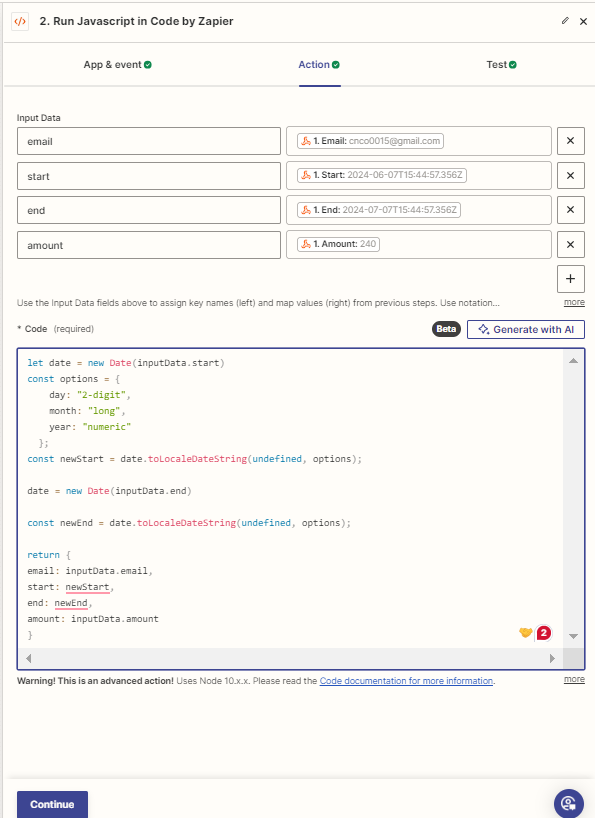
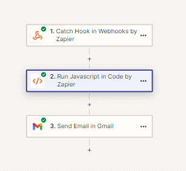
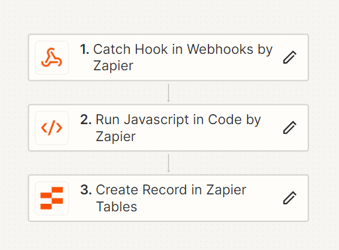
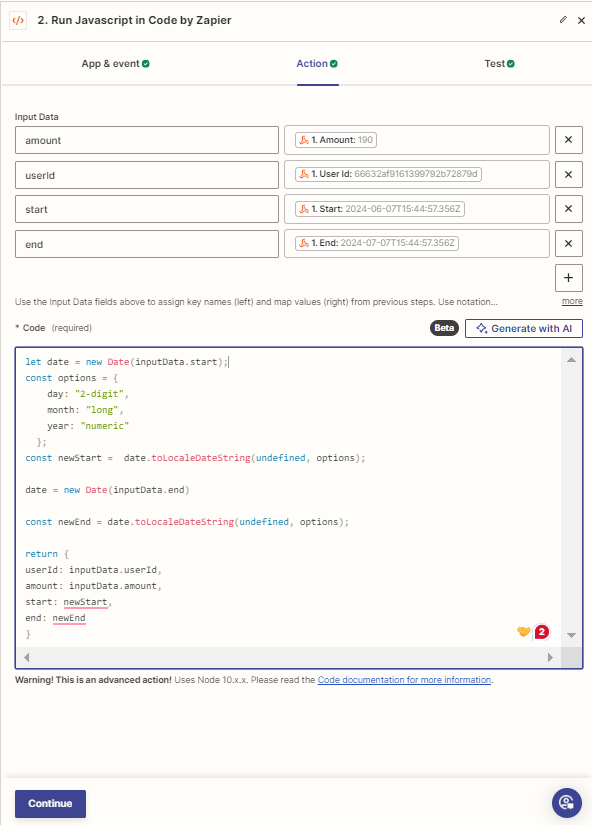

# Billing Application
## Project overview:
This project uses Zapier to automate the billing and invoicing process
Users signup and based on the usage of the APIs of the application the user can generate invoices

## Project setup for Backend
Clone the repository by `git clone`
Setup the environment variables in the .env file in the root of the project

`GOOGLE_CLIENT_SECRET`, `GOOGLE_CLIENT_ID`. You can get these two from the google cloud console by seting up new project and generate OAuth Credentials,

Install all the dependencies using `npm install`

This project is using MongoDB as database so you will have to create a mongo cluster and copy the mongo connection URL to the .env file name it as `MONGO_URL`

Go to Zapier.com and create a new account if you don't have one.

## Project setup for frontend

install all the dependencies using `npm install`. Then you are good to go.

## Zapier setup fpr the backend
For Zapier there are two workflows (Zaps)
1. Sending automated emails to the Users

    Create a trigger using Zapier webhook select catch hook option
    Then copy the webhook URL and paste it in the .env file
    Then add action Code with Zapier
This workflow will be triggered when user will generate invoice and the invoice will be sent to the user's email

2. Adding rows in the billing table in Zapier 

    Create a trigger using Zapier webhook select catch hook option
    Then copy the webhook URL and paste it in the .env file
    We will use Zapier table action

Now that the project setup has completed let's move on to the Application flow

# Application Flow

1. Google sign in

    User come to the landing page of the application. User have to sign in to the application using google account without that then cannot access the application

2. After the sign in process users are redirected to the dashboard page from where you can make api calls. The more API calls you make your usage increases
As your usage increases the billing table in Zapier get updated using the webhook trigger 

3. In the billing section of the app you can see the usage detail with current billing cycle and cumulative usage

4. On the dashboard page you can also generate invoice. This uses zapier workflow to send automated invoices through email to the user

5. In the profile page you see your account information and you can also logout of the application. As soon as the user logout of the application the user is redirected to the landing page

6. Routes and protected so that if the user is not signed in then user cannot access the routes in the application

7. React context api is used to manage user session across entire application. This makes user management easy.

Thank you

